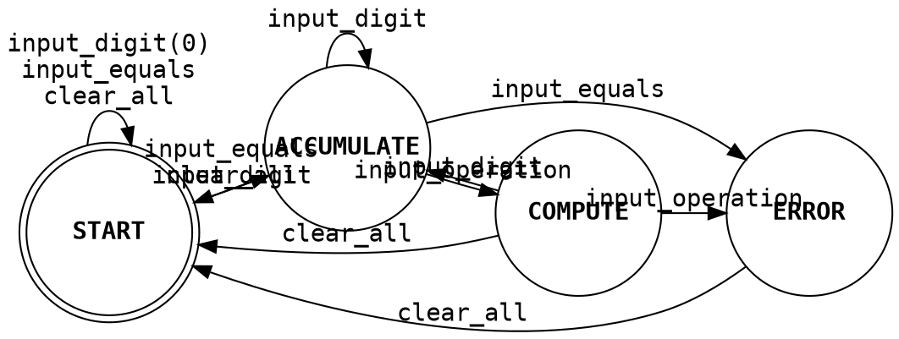

# LFS Testing Demo

A toy application to demonstrate software testing principles and techniques for the [Learning Futures](https://lf.asu.edu/) Studio associates.

## Architecture

We're going to have a calculator engine that implements the behavior separate from the user interface, which mediates between the user and the engine.

### Engine

The calculator engine only manages three values:

- `display <string>`: What would be shown on the display, and where we append digits.
- `pending_operator <Operator>`: Where we store the pending operator to implement infix operations
- `accumulator <float>`: The first operand for the pending operator (with the `display` being the second).

The calculator engine implements a reduced FSM from [Rice Comp 212](https://www.clear.rice.edu/comp212/06-spring/labs/13/). It handles infix computations, but without order of operations precedence.

## References

- [International Software Testing Qualifications Board principles of testing](https://astqb.org/assets/documents/CTFL-2018-Syllabus.pdf)
- [Andrew Knight (Automation Panda) software testing convictions](https://automationpanda.com/2022/08/23/making-great-waves-8-software-testing-convictions/)
